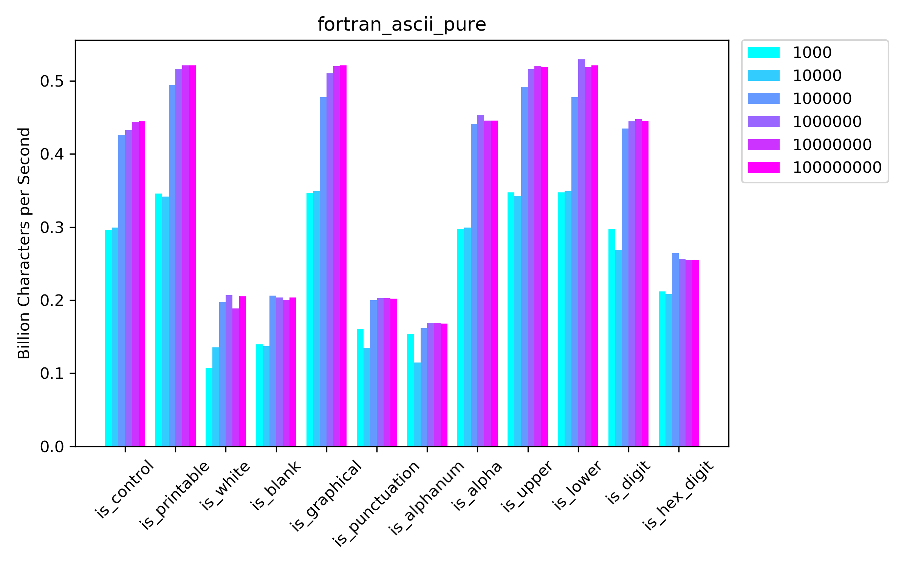
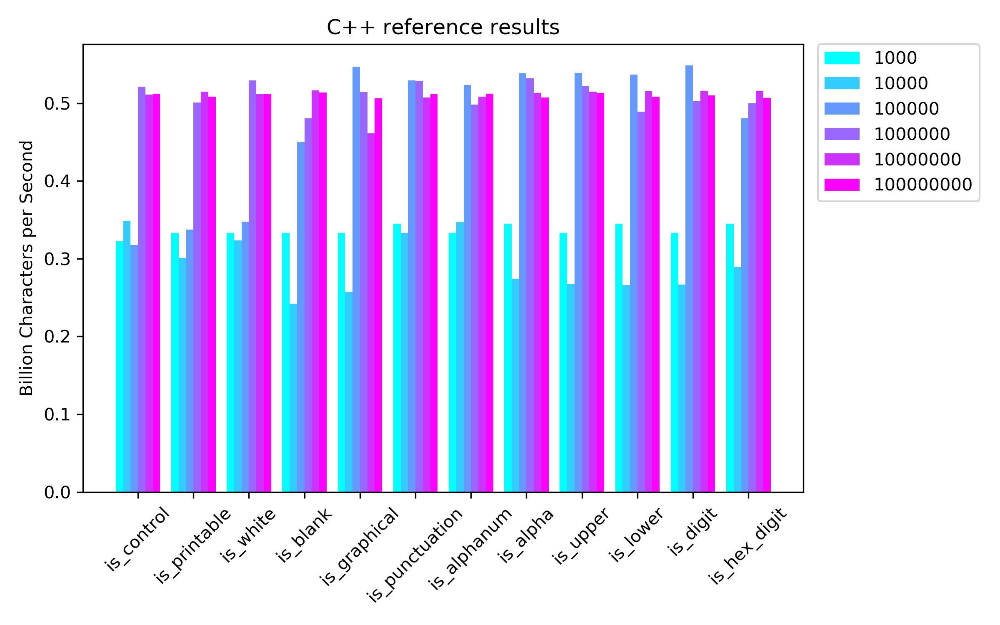
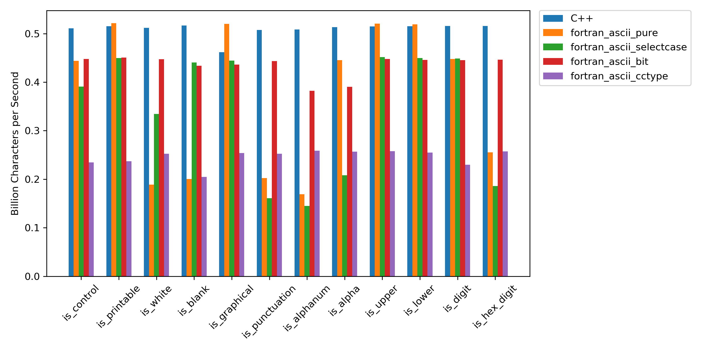

# Fortran functions which operate on ASCII characters

This repository contains Fortran routines aiming to reproduce the functionality found in [`<ctype.h>`](https://en.wikipedia.org/wiki/C_character_classification) header of the C standard library or [std.ascii](https://dlang.org/phobos/std_ascii.html) namespace from the D runtime library.

Currently, this is just my personal testing ground that should later become a pull request to the recent Fortran [stdlib](https://github.com/fortran-lang/stdlib) project (see also issue [#11](https://github.com/fortran-lang/stdlib/issues/11) and my previous pull requests [#32](https://github.com/fortran-lang/stdlib/pull/32), and [#49](https://github.com/fortran-lang/stdlib/pull/49)).

TODO: 
 * Unicode support (or wide characters in general)

## Building

```
git clone https://github.com/ivan-pi/fortran-ascii
cd fortran-ascii
```

A Makefile is provided to build the following executables via `make <target>`, where target is one of:
* `test_ascii` (default target): test routines for the ASCII functions
* `benchmark_f90`: benchmarking the Fortran routines
* `benchmark_cpp`: benchmark the C++ routines
* `generate_characters`: generates character strings used by the benchmarks
* `generate_ascii_table`: generates the ASCII lookup table (not relevant anymore)
* `print_table`: print the lookup table defined in `fortran_ascii_bits.f90`

To set the compiler and flags use:
```
make FC=gfortran-9 FFLAGS="-O3 -march=native" benchmark_f90
```

One of the main goals of this repository is to test different implementations of the character routines (see sections below). This can be done very smoothly using submodules, which separate the function interfaces from the actual implementations.

The Makefile uses the `SM` variable to link with a specific submodule:
```
make SM=bit benchmark_f90
```
Try switching between `pure`, `bit`, `selectcase`, and `cctype`, and comparing the performance. 

A shell script is available to run benchmarks for all four implementations and a reference in C++:
```
./run_benchmarks.sh
```
The results are given as *processed characters per second* and are exported as txt files. If you switch the compiler run `make clean` between trials.

## Routines

### Character classification

All Fortran routines accept a default `character(len=1)` dummy variable and return a logical value. This differs from the C routines which accept and return an integer value.

|                          Purpose                          |     Fortran      |   C/C++  |       D       |   Python*   |
|:---------------------------------------------------------|:----------------:|:--------:|:-------------:|:-----------:|
|            Checks if a character is alphabetic            |    `is_alpha`    |  `isalpha` |    `isAlpha`    |   `isalpha`   |
|           Checks if a character is alphanumeric           |   `is_alphanum`  |  `isalnum` |   `isAlphaNum`  |   `isalnum`   |
|    Checks if a character is in the ASCII character set    |    `is_ascii`    |      /    |    `isASCII`    |   `isascii`   |
|        Checks if a character is a control character       |   `is_control`   |  `iscntrl` |   `isControl`   |             |
|              Checks if a character is a digit             |    `is_digit`    |  `isdigit` |    `isDigit`    |   `isdigit`   |
|         Checks if a character is a octal character        | `is_octal_digit` |     /    |  `isOctalDigit` |             |
| Checks if a character is a hexadecimal character          | `is_hex_digit`   | `isxdigit` | `isHexDigit`    |             |
| Checks if a character is a punctuation character          | `is_punctuation` | `ispunct`  | `isPunctuation` |             |
| Checks if a character is a graphical character            | `is_graphical`   | `isgraph`  | `isGraphical`  |             |
| Checks if a character is a printing character             | `is_printable`   | `isprint`  | `isPrintable`   | `isprintable` |
| Checks if a character is an uppercase character           | `is_upper`       | `isupper`  | `isUpper`       | `isupper`     |
| Checks if a character is lowercase                        | `is_lower`       | `islower`  | `isLower`       | `islower`     |
| Checks if a character is a whitespace character           | `is_white`       | `isspace`  | `isWhite`       | `isspace`     |
| Checks if a character is a blank character (space or tab) | `is_blank`       | `isblank`  | /             |             |


### Case conversion

These routines accept a `character(len=1)` argument and return the same character with swapped case. 

|                          Purpose                          |     Fortran      |   C/C++  |       D       |   Python*   |
|:---------------------------------------------------------|:----------------:|:--------:|:-------------:|:-----------:|
| Converts a character to lowercase                         | `to_lower`       | `tolower`  | `toLower`       |             |
| Converts a character to uppercase                         | `to_upper`       | `toupper`  | `toUpper`       |             |

## Implementation approaches

### Direct approach

In this approach we use comparison operators and the default character collating sequence (if applicable) to validate the characters. 

Example for `is_alphanum`:

```fortran
pure logical function is_alphanum(c)
  character(len=1), intent(in) :: c !! The character to test.
  is_alphanum = (c >= '0' .and. c <= '9') .or. (c >= 'a' .and. c <= 'z') &
      .or. (c >= 'A' .and. c <= 'Z')
end function
```

For characters with no guarantee on position in the collating sequence we use the `iachar` intrinsic to check the position in the ASCII character set.

Example for `is_control`:

```fortran
pure logical function is_control(c)
  character(len=1), intent(in) :: c !! The character to test.
  integer :: ic
  ic = iachar(c)
  is_control = ic < z'20' .or. ic == z'7F'
end function
```

### Select case 

Instead of comparison operators, we can also use the select case construct and `iachar` intrinsic to verify the character belongs to a specific set. This approach can be found in the Dan Nagle's [`character_functions`](http://www.daniellnagle.com/charfunc.html) module.

Example for `is_alphanum`:
```fortran
pure logical function is_alphanum(c)
  character(len=1), intent(in) :: c !! The character to test.
  select case(iachar(c))
    case (48:57,65:90,97:122) ! A .. Z, 0 .. 9, a .. z
      is_alphanum = .true.
    case default
      is_alphanum = .false.
  end select
end function
```

Example for `is_control`:
```fortran
pure logical function is_control(c)
  character(len=1), intent(in) :: c !! The character to test.
  select case(iachar(c))
    case (0:31,127) ! contral chars, delete
      is_control = .true.
    case default
      is_control = .false.
  end select
end function
```
### Lookup table

As noted on the [C character classification](https://en.wikipedia.org/wiki/C_character_classification) Wikipedia page:

> ...the character classification routines are not written as comparison tests. In most C libraries, they are written as static table lookups instead of macros or functions. 

This approach can be mimicked also in Fortran. Since there are 13 functions (excluding `is_ascii`) we require an integer with a storage size of at least 13 bits to encode the various properties. ~(Perhaps even 11-bits suffice.)~ Here we simply use the `int16` from the `iso_fortran_env` module. On architectures with word sizes smaller than 8 bits, it might be benefical to use the result of `selected_int_kind(4)`; this covers integers in the range from -10^4 to 10^4 (exclusive), thereby including the largest necessary mask 2^12 = 4096. First we create the bitmasks for the different character properties by left-shifting the value one:
```fortran
integer(i16), parameter :: m_upper       = shiftl(1_i16,0)
integer(i16), parameter :: m_lower       = shiftl(1_i16,1)
integer(i16), parameter :: m_alpha       = shiftl(1_i16,2)
integer(i16), parameter :: m_digit       = shiftl(1_i16,3)
integer(i16), parameter :: m_hex_digit   = shiftl(1_i16,4)
integer(i16), parameter :: m_octal_digit = shiftl(1_i16,5)
integer(i16), parameter :: m_space       = shiftl(1_i16,6)
integer(i16), parameter :: m_printable   = shiftl(1_i16,7)
integer(i16), parameter :: m_graphical   = ior(ior(m_alpha,m_digit),shiftl(1_i16,10)) ! alnum|punct
integer(i16), parameter :: m_control     = shiftl(1_i16,9)
integer(i16), parameter :: m_punctuation = shiftl(1_i16,10)
integer(i16), parameter :: m_alphanum    = ior(m_alpha,m_digit)
integer(i16), parameter :: m_blank       = shiftl(1_i16,12)
```
The mask for alphanumerical characters is built using the bitwise logical **or** of the digit and alphabetical masks. Similarly, the mask for graphical characters is built from the masks for alphabetical characters, digits, and punctuation.

Next, we populate a look-up table, assigning the ASCII characters their respective masks: 

<details>
  <summary>Click here to see the complete lookup table</summary>

```fortran
integer(i16), parameter :: table(-128:127) = [ integer(i16) ::&
      ! The first 128 entries are all 0.
      0, 0, 0, 0, 0, 0, 0, 0, 0, 0, 0, 0, 0, 0, 0, 0,&
      0, 0, 0, 0, 0, 0, 0, 0, 0, 0, 0, 0, 0, 0, 0, 0,&
      0, 0, 0, 0, 0, 0, 0, 0, 0, 0, 0, 0, 0, 0, 0, 0,&
      0, 0, 0, 0, 0, 0, 0, 0, 0, 0, 0, 0, 0, 0, 0, 0,&
      0, 0, 0, 0, 0, 0, 0, 0, 0, 0, 0, 0, 0, 0, 0, 0,&
      0, 0, 0, 0, 0, 0, 0, 0, 0, 0, 0, 0, 0, 0, 0, 0,&
      0, 0, 0, 0, 0, 0, 0, 0, 0, 0, 0, 0, 0, 0, 0, 0,&
      0, 0, 0, 0, 0, 0, 0, 0, 0, 0, 0, 0, 0, 0, 0, 0,&
      m_control,& ! null 
      m_control,& ! ^A 
      m_control,& ! ^B 
      m_control,& ! ^C 
      m_control,& ! ^D 
      m_control,& ! ^E 
      m_control,& ! ^F 
      m_control,& ! ^G 
      m_control,& ! ^H 
      ior(ior(m_space,m_control),m_blank),& ! tab 
      ior(m_space,m_control),& ! LF 
      ior(m_space,m_control),& ! ^K 
      ior(m_space,m_control),& ! FF 
      ior(m_space,m_control),& ! ^M 
      m_control,& ! ^N 
      m_control,& ! ^O 
      m_control,& ! ^P 
      m_control,& ! ^Q 
      m_control,& ! ^R 
      m_control,& ! ^S 
      m_control,& ! ^T 
      m_control,& ! ^U 
      m_control,& ! ^V 
      m_control,& ! ^W 
      m_control,& ! ^X 
      m_control,& ! ^Y 
      m_control,& ! ^Z 
      m_control,& ! esc 
      m_control,& ! ^\ 
      m_control,& ! ^] 
      m_control,& ! ^^ 
      m_control,& ! ^_ 
      ior(ior(m_space,m_printable),m_blank),& ! space   
      ior(m_punctuation,m_printable),& ! ! 
      ior(m_punctuation,m_printable),& ! " 
      ior(m_punctuation,m_printable),& ! # 
      ior(m_punctuation,m_printable),& ! $ 
      ior(m_punctuation,m_printable),& ! % 
      ior(m_punctuation,m_printable),& ! & 
      ior(m_punctuation,m_printable),& ! ' 
      ior(m_punctuation,m_printable),& ! ( 
      ior(m_punctuation,m_printable),& ! ) 
      ior(m_punctuation,m_printable),& ! * 
      ior(m_punctuation,m_printable),& ! + 
      ior(m_punctuation,m_printable),& ! , 
      ior(m_punctuation,m_printable),& ! - 
      ior(m_punctuation,m_printable),& ! . 
      ior(m_punctuation,m_printable),& ! / 
      ior(ior(ior(m_digit,m_hex_digit),m_printable),m_octal_digit),& ! 0 
      ior(ior(ior(m_digit,m_hex_digit),m_printable),m_octal_digit),& ! 1 
      ior(ior(ior(m_digit,m_hex_digit),m_printable),m_octal_digit),& ! 2 
      ior(ior(ior(m_digit,m_hex_digit),m_printable),m_octal_digit),& ! 3 
      ior(ior(ior(m_digit,m_hex_digit),m_printable),m_octal_digit),& ! 4 
      ior(ior(ior(m_digit,m_hex_digit),m_printable),m_octal_digit),& ! 5 
      ior(ior(ior(m_digit,m_hex_digit),m_printable),m_octal_digit),& ! 6 
      ior(ior(ior(m_digit,m_hex_digit),m_printable),m_octal_digit),& ! 7 
      ior(ior(m_digit,m_hex_digit),m_printable),& ! 8 
      ior(ior(m_digit,m_hex_digit),m_printable),& ! 9 
      ior(m_punctuation,m_printable),& ! : 
      ior(m_punctuation,m_printable),& ! ; 
      ior(m_punctuation,m_printable),& ! < 
      ior(m_punctuation,m_printable),& ! = 
      ior(m_punctuation,m_printable),& ! > 
      ior(m_punctuation,m_printable),& ! ? 
      ior(m_punctuation,m_printable),& ! ! 
      ior(ior(ior(m_alpha,m_upper),m_hex_digit),m_printable),& ! A 
      ior(ior(ior(m_alpha,m_upper),m_hex_digit),m_printable),& ! B 
      ior(ior(ior(m_alpha,m_upper),m_hex_digit),m_printable),& ! C 
      ior(ior(ior(m_alpha,m_upper),m_hex_digit),m_printable),& ! D 
      ior(ior(ior(m_alpha,m_upper),m_hex_digit),m_printable),& ! E 
      ior(ior(ior(m_alpha,m_upper),m_hex_digit),m_printable),& ! F 
      ior(ior(m_alpha,m_upper),m_printable),& ! G 
      ior(ior(m_alpha,m_upper),m_printable),& ! H 
      ior(ior(m_alpha,m_upper),m_printable),& ! I 
      ior(ior(m_alpha,m_upper),m_printable),& ! J 
      ior(ior(m_alpha,m_upper),m_printable),& ! K 
      ior(ior(m_alpha,m_upper),m_printable),& ! L 
      ior(ior(m_alpha,m_upper),m_printable),& ! M 
      ior(ior(m_alpha,m_upper),m_printable),& ! N 
      ior(ior(m_alpha,m_upper),m_printable),& ! O 
      ior(ior(m_alpha,m_upper),m_printable),& ! P 
      ior(ior(m_alpha,m_upper),m_printable),& ! Q 
      ior(ior(m_alpha,m_upper),m_printable),& ! R 
      ior(ior(m_alpha,m_upper),m_printable),& ! S 
      ior(ior(m_alpha,m_upper),m_printable),& ! T 
      ior(ior(m_alpha,m_upper),m_printable),& ! U 
      ior(ior(m_alpha,m_upper),m_printable),& ! V 
      ior(ior(m_alpha,m_upper),m_printable),& ! W 
      ior(ior(m_alpha,m_upper),m_printable),& ! X 
      ior(ior(m_alpha,m_upper),m_printable),& ! Y 
      ior(ior(m_alpha,m_upper),m_printable),& ! Z 
      ior(m_punctuation,m_printable),& ! [ 
      ior(m_punctuation,m_printable),& ! \ 
      ior(m_punctuation,m_printable),& ! ] 
      ior(m_punctuation,m_printable),& ! ^ 
      ior(m_punctuation,m_printable),& ! _ 
      ior(m_punctuation,m_printable),& ! ` 
      ior(ior(ior(m_alpha,m_lower),m_hex_digit),m_printable),& ! a 
      ior(ior(ior(m_alpha,m_lower),m_hex_digit),m_printable),& ! b 
      ior(ior(ior(m_alpha,m_lower),m_hex_digit),m_printable),& ! c 
      ior(ior(ior(m_alpha,m_lower),m_hex_digit),m_printable),& ! d 
      ior(ior(ior(m_alpha,m_lower),m_hex_digit),m_printable),& ! e 
      ior(ior(ior(m_alpha,m_lower),m_hex_digit),m_printable),& ! f 
      ior(ior(m_alpha,m_lower),m_printable),& ! g 
      ior(ior(m_alpha,m_lower),m_printable),& ! h 
      ior(ior(m_alpha,m_lower),m_printable),& ! i 
      ior(ior(m_alpha,m_lower),m_printable),& ! j 
      ior(ior(m_alpha,m_lower),m_printable),& ! k 
      ior(ior(m_alpha,m_lower),m_printable),& ! l 
      ior(ior(m_alpha,m_lower),m_printable),& ! m 
      ior(ior(m_alpha,m_lower),m_printable),& ! n 
      ior(ior(m_alpha,m_lower),m_printable),& ! o 
      ior(ior(m_alpha,m_lower),m_printable),& ! p 
      ior(ior(m_alpha,m_lower),m_printable),& ! q 
      ior(ior(m_alpha,m_lower),m_printable),& ! r 
      ior(ior(m_alpha,m_lower),m_printable),& ! s 
      ior(ior(m_alpha,m_lower),m_printable),& ! t 
      ior(ior(m_alpha,m_lower),m_printable),& ! u 
      ior(ior(m_alpha,m_lower),m_printable),& ! v 
      ior(ior(m_alpha,m_lower),m_printable),& ! w 
      ior(ior(m_alpha,m_lower),m_printable),& ! x 
      ior(ior(m_alpha,m_lower),m_printable),& ! y 
      ior(ior(m_alpha,m_lower),m_printable),& ! x 
      ior(m_punctuation,m_printable),& ! { 
      ior(m_punctuation,m_printable),& ! | 
      ior(m_punctuation,m_printable),& ! } 
      ior(m_punctuation,m_printable),& ! ~ 
      m_control] ! del (0x7f)
```
</details>

The reason why the first 128 characters are filled with zeros will be explained later. To make sure things worked correctly, we can write a short program to display the characters and their binary property masks:
```fortran
  do i = 0, 127
      c = achar(i)
      if (is_printable(c)) then
        write(*,'(I3,3X,A,3X,I4,3X,B0.16)') i, c, table(i), table(i)
      end if
  end do
```
<details>
  <summary>Click here to see the result.</summary>
  
```
 32       4288   0001000011000000
 33   !   1152   0000010010000000
 34   "   1152   0000010010000000
 35   #   1152   0000010010000000
 36   $   1152   0000010010000000
 37   %   1152   0000010010000000
 38   &   1152   0000010010000000
 39   '   1152   0000010010000000
 40   (   1152   0000010010000000
 41   )   1152   0000010010000000
 42   *   1152   0000010010000000
 43   +   1152   0000010010000000
 44   ,   1152   0000010010000000
 45   -   1152   0000010010000000
 46   .   1152   0000010010000000
 47   /   1152   0000010010000000
 48   0    184   0000000010111000
 49   1    184   0000000010111000
 50   2    184   0000000010111000
 51   3    184   0000000010111000
 52   4    184   0000000010111000
 53   5    184   0000000010111000
 54   6    184   0000000010111000
 55   7    184   0000000010111000
 56   8    152   0000000010011000
 57   9    152   0000000010011000
 58   :   1152   0000010010000000
 59   ;   1152   0000010010000000
 60   <   1152   0000010010000000
 61   =   1152   0000010010000000
 62   >   1152   0000010010000000
 63   ?   1152   0000010010000000
 64   @   1152   0000010010000000
 65   A    149   0000000010010101
 66   B    149   0000000010010101
 67   C    149   0000000010010101
 68   D    149   0000000010010101
 69   E    149   0000000010010101
 70   F    149   0000000010010101
 71   G    133   0000000010000101
 72   H    133   0000000010000101
 73   I    133   0000000010000101
 74   J    133   0000000010000101
 75   K    133   0000000010000101
 76   L    133   0000000010000101
 77   M    133   0000000010000101
 78   N    133   0000000010000101
 79   O    133   0000000010000101
 80   P    133   0000000010000101
 81   Q    133   0000000010000101
 82   R    133   0000000010000101
 83   S    133   0000000010000101
 84   T    133   0000000010000101
 85   U    133   0000000010000101
 86   V    133   0000000010000101
 87   W    133   0000000010000101
 88   X    133   0000000010000101
 89   Y    133   0000000010000101
 90   Z    133   0000000010000101
 91   [   1152   0000010010000000
 92   \   1152   0000010010000000
 93   ]   1152   0000010010000000
 94   ^   1152   0000010010000000
 95   _   1152   0000010010000000
 96   `   1152   0000010010000000
 97   a    150   0000000010010110
 98   b    150   0000000010010110
 99   c    150   0000000010010110
100   d    150   0000000010010110
101   e    150   0000000010010110
102   f    150   0000000010010110
103   g    134   0000000010000110
104   h    134   0000000010000110
105   i    134   0000000010000110
106   j    134   0000000010000110
107   k    134   0000000010000110
108   l    134   0000000010000110
109   m    134   0000000010000110
110   n    134   0000000010000110
111   o    134   0000000010000110
112   p    134   0000000010000110
113   q    134   0000000010000110
114   r    134   0000000010000110
115   s    134   0000000010000110
116   t    134   0000000010000110
117   u    134   0000000010000110
118   v    134   0000000010000110
119   w    134   0000000010000110
120   x    134   0000000010000110
121   y    134   0000000010000110
122   z    134   0000000010000110
123   {   1152   0000010010000000
124   |   1152   0000010010000000
125   }   1152   0000010010000000
126   ~   1152   0000010010000000
```
</details>

We can easily see how characters with the same set of properties (alpha,digit,upper,lower,...) share the same bitmask.


For the actual validation functions we use the `iachar` intrinsic to find the correct value in the lookup table and call the `btest` intrinsic to verify if the bit encoding the target property is set.

Example for `is_alpha`:

```fortran
pure logical function is_alpha(c)
  character(len=1), intent(in) :: c !! The character to test.
  is_alpha = btest(table(iachar(c,i8)),2)
end function
```

A second approach is to apply a bitwise logical **and** and check the result is not zero. (See [this](http://pdebuyl.be/blog/2018/fortran-bitmasks.html) blog post by Pierre de Buyl to brush up on Fortran bitmasks.)

Example for `is_control`:
```fortran
pure logical function is_control(c)
  character(len=1), intent(in) :: c !! The character to test.
  is_control = iand(table(iachar(c,i8)),m_control) /= 0
end function
```

For the functions `is_graphical` and `is_alphanum` (these properties are encoded via multiple bits) we can either follow the second approach or test multiple bits (e.g. for `is_alphanum` we need to test the bits at positions 2 and 3 with a logical `.or.` inbetween).

At the time of writing, I am still not sure how to deal correctly with any non-ASCII characters, which might still fit into the size of the `character(len=1)` type (typically, this is one byte). The way this seems to be dealt with in the C standard library is by casting the character as an `unsigned short` integer taking on 8-bits (values from 0 to 255) and using a lookup table with 256 values. Since Fortran does not provide unsigned integers, the approach I've adopted is to use custom array bounds from -128 to 127, which fit the range of values for the `integer(int8)` type. Hence, the zeros in the first 128 table elements. To make this work as desired, we also need to provide `int8` (from the `iso_fortran_env` module) as the kind parameter in calls to the intrinsic `iachar(c[,kind])`.

### C binding

For compilers such as gfortran and ifort, the final executable is typically linked to the C standard library (see [this]() discussion). This means we can easily borrow the functionality from C (apart from the function for octal digits, which is not part of the C standard library). 

First, we create a module that defines the interfaces of the functions in `<ctype.h>`:

```fortran
module cctype

  use iso_c_binding, only: c_int
  implicit none
  public

  interface
    pure integer(c_int) function isalnum(c) bind(c,name='isalnum')
      import c_int
      integer(c_int), intent(in), value :: c
    end function isalnum
    pure integer(c_int) function iscntrl(c) bind(c,name='iscntrl')
      import c_int
      integer(c_int), intent(in), value :: c
    end function iscntrl

    ! ... remaining functions ...

  end interface
end module
```

Then we use the `iachar` intrinsic to convert Fortran characters to C integers and pass them to C routines. The return value of the C routines is an integer different from zero (i.e., `true`) for characters which have the tested property, and zero (i.e. `false`) otherwise.

Example for `is_alphanum`:
```fortran
pure logical function is_alphanum(c)
  character(len=1), intent(in) :: c !! The character to test.
  is_alphanum = isalnum(iachar(c,c_int)) /= 0
end function
```

Example for `is_control`:
```fortran
pure logical function is_control(c)
  character(len=1), intent(in) :: c !! The character to test.
  is_control = iscntrl(iachar(c,c_int)) /= 0
end function
```

## Results

The results shown below are from a ThinkPad T530 with an Intel(R) Core(TM) i5-3320M 2.6 GHz CPU and 16GB of RAM (DDR3 SODIMM). The operating system is Ubuntu 16.04 64-bit.

### gfortran

The benchmark drivers (for both gfortran and g++) were compiled with `-O3 -mtune=native`. The first column is the number of characters tested. The remaining columns give the number of processed characters per second. Each row is the average of 10 loop iterations.

#### Direct approach (`pure`)

```
#             is_control   is_printable       is_white       is_blank   is_graphical is_punctuation    is_alphanum       is_alpha       is_upper       is_lower       is_digit   is_hex_digit
     1000   0.295902E+09   0.345805E+09   0.107078E+09   0.139196E+09   0.346957E+09   0.160805E+09   0.154152E+09   0.297965E+09   0.347174E+09   0.347379E+09   0.297876E+09   0.211689E+09
    10000   0.299134E+09   0.341720E+09   0.135319E+09   0.136704E+09   0.348956E+09   0.134952E+09   0.114378E+09   0.299184E+09   0.342490E+09   0.349018E+09   0.269007E+09   0.208021E+09
   100000   0.426288E+09   0.494526E+09   0.197466E+09   0.205922E+09   0.477580E+09   0.199789E+09   0.161736E+09   0.441021E+09   0.491093E+09   0.477734E+09   0.435060E+09   0.264156E+09
  1000000   0.432747E+09   0.516781E+09   0.206718E+09   0.203574E+09   0.510438E+09   0.202444E+09   0.169083E+09   0.453219E+09   0.516010E+09   0.529410E+09   0.444434E+09   0.256150E+09
 10000000   0.443961E+09   0.521427E+09   0.188798E+09   0.200465E+09   0.520107E+09   0.202299E+09   0.168897E+09   0.445520E+09   0.520562E+09   0.518847E+09   0.447540E+09   0.255309E+09
100000000   0.444802E+09   0.521159E+09   0.205292E+09   0.203831E+09   0.521019E+09   0.201788E+09   0.167931E+09   0.445627E+09   0.519019E+09   0.521419E+09   0.445376E+09   0.255544E+09
```

#### Select case (`selectcase`)

```
#             is_control   is_printable       is_white       is_blank   is_graphical is_punctuation    is_alphanum       is_alpha       is_upper       is_lower       is_digit   is_hex_digit
     1000   0.382307E+09   0.437963E+09   0.342021E+09   0.438020E+09   0.439967E+09   0.176053E+09   0.234456E+09   0.247788E+09   0.439734E+09   0.439967E+09   0.439657E+09   0.225154E+09
    10000   0.386439E+09   0.441638E+09   0.343540E+09   0.441647E+09   0.441677E+09   0.155772E+09   0.160909E+09   0.217044E+09   0.470183E+09   0.470172E+09   0.470174E+09   0.193561E+09
   100000   0.399968E+09   0.450582E+09   0.334573E+09   0.394983E+09   0.461833E+09   0.152483E+09   0.143694E+09   0.203813E+09   0.438749E+09   0.400575E+09   0.437472E+09   0.188699E+09
  1000000   0.390082E+09   0.445382E+09   0.352295E+09   0.436648E+09   0.450134E+09   0.162312E+09   0.144433E+09   0.189585E+09   0.450995E+09   0.451086E+09   0.451696E+09   0.187176E+09
 10000000   0.390598E+09   0.449703E+09   0.334224E+09   0.440343E+09   0.444530E+09   0.160974E+09   0.144977E+09   0.208038E+09   0.451376E+09   0.449494E+09   0.448684E+09   0.185860E+09
100000000   0.394643E+09   0.447510E+09   0.349625E+09   0.447777E+09   0.448016E+09   0.161371E+09   0.144631E+09   0.206839E+09   0.448119E+09   0.444974E+09   0.448962E+09   0.186707E+09
```

#### Lookup table (`bit`)

```
#             is_control   is_printable       is_white       is_blank   is_graphical is_punctuation    is_alphanum       is_alpha       is_upper       is_lower       is_digit   is_hex_digit
     1000   0.159434E+09   0.226357E+09   0.226413E+09   0.227082E+09   0.227123E+09   0.226963E+09   0.198602E+09   0.198791E+09   0.226968E+09   0.227082E+09   0.226989E+09   0.227087E+09
    10000   0.216196E+09   0.224825E+09   0.227966E+09   0.227971E+09   0.222979E+09   0.197703E+09   0.207068E+09   0.191618E+09   0.234079E+09   0.210028E+09   0.227929E+09   0.223578E+09
   100000   0.227998E+09   0.333144E+09   0.397760E+09   0.420600E+09   0.428791E+09   0.440839E+09   0.381704E+09   0.392492E+09   0.445905E+09   0.437860E+09   0.454628E+09   0.430326E+09
  1000000   0.445413E+09   0.444731E+09   0.450100E+09   0.434676E+09   0.445038E+09   0.446458E+09   0.389616E+09   0.383579E+09   0.445309E+09   0.450493E+09   0.433688E+09   0.448359E+09
 10000000   0.447539E+09   0.450530E+09   0.447429E+09   0.433857E+09   0.436260E+09   0.443248E+09   0.382014E+09   0.390311E+09   0.447822E+09   0.445711E+09   0.445183E+09   0.446293E+09
100000000   0.446386E+09   0.447392E+09   0.447972E+09   0.446720E+09   0.446444E+09   0.447610E+09   0.390032E+09   0.391572E+09   0.446561E+09   0.446939E+09   0.449459E+09   0.447393E+09
```

#### C binding (`cctype`)

```
#             is_control   is_printable       is_white       is_blank   is_graphical is_punctuation    is_alphanum       is_alpha       is_upper       is_lower       is_digit   is_hex_digit
     1000   0.235388E+09   0.256089E+09   0.256680E+09   0.205491E+09   0.256812E+09   0.256746E+09   0.256239E+09   0.256779E+09   0.256779E+09   0.256792E+09   0.237113E+09   0.256739E+09
    10000   0.237803E+09   0.257646E+09   0.257664E+09   0.206148E+09   0.252265E+09   0.251348E+09   0.274277E+09   0.274288E+09   0.274290E+09   0.274284E+09   0.245206E+09   0.274271E+09
   100000   0.243029E+09   0.254922E+09   0.263502E+09   0.212183E+09   0.223243E+09   0.255979E+09   0.250611E+09   0.247153E+09   0.259765E+09   0.247556E+09   0.244033E+09   0.268073E+09
  1000000   0.231861E+09   0.256933E+09   0.260220E+09   0.208580E+09   0.257341E+09   0.258544E+09   0.262324E+09   0.257480E+09   0.257221E+09   0.260155E+09   0.240084E+09   0.259270E+09
 10000000   0.234693E+09   0.236757E+09   0.252244E+09   0.204679E+09   0.254001E+09   0.252421E+09   0.258623E+09   0.256673E+09   0.257663E+09   0.254969E+09   0.229814E+09   0.257418E+09
100000000   0.236562E+09   0.250049E+09   0.253881E+09   0.206114E+09   0.254522E+09   0.255598E+09   0.257089E+09   0.256059E+09   0.254120E+09   0.254236E+09   0.234923E+09   0.255699E+09
```

#### Reference in C++ (`cpp`)

Order of the functions is the same as in the Fortran benchmark.

```
     1000   3.225806e+08   3.333333e+08   3.333333e+08   3.333333e+08   3.333333e+08   3.448276e+08   3.333333e+08   3.448276e+08   3.333333e+08   3.448276e+08   3.333333e+08   3.448276e+08
    10000   3.484321e+08   3.012048e+08   3.236246e+08   2.421308e+08   2.570694e+08   3.333333e+08   3.472222e+08   2.739726e+08   2.673797e+08   2.659574e+08   2.666667e+08   2.890173e+08
   100000   3.177629e+08   3.374958e+08   3.475843e+08   4.500450e+08   5.470460e+08   5.293806e+08   5.232862e+08   5.382131e+08   5.387931e+08   5.370569e+08   5.485464e+08   4.803074e+08
  1000000   5.211591e+08   5.010773e+08   5.291845e+08   4.804920e+08   5.140860e+08   5.289046e+08   4.984299e+08   5.322263e+08   5.224115e+08   4.893565e+08   5.028916e+08   4.997751e+08
 10000000   5.109314e+08   5.150391e+08   5.115875e+08   5.165743e+08   4.614355e+08   5.073206e+08   5.086082e+08   5.132680e+08   5.149437e+08   5.151718e+08   5.159000e+08   5.156792e+08
100000000   5.122814e+08   5.084099e+08   5.114697e+08   5.138601e+08   5.061753e+08   5.119169e+08   5.123977e+08   5.072774e+08   5.130184e+08   5.082052e+08   5.099015e+08   5.066947e+08
```

### Figures

#### Speed vs number of characters (`pure`)



We need atleast 1000000 characters to reach full speed, otherwise the timings are influenced by function call overheads...

Also note the large differences between various functions. The `is_punctuation` and `is_alphanum` functions contain the most complicated if logical sentences.

On the other hand, the results in C++ show fairly equal behavior across all functions, hinting at the implementation based on a lookup table.



#### Speed vs different implementation approaches

Based on the measurements above we use the results for 10000000 characters to compare the different implementation approaches.

There is no clear cut winner. The lookup table based approach shows consistent timings across all functions, but 10 to 20 % slower than C++. The "direct" approach (the one currently used in Fortran stdlib) is able to compete with C++ on the simpler routines `is_printable`, `is_graphical`, `is_upper`, and `is_lower`, for which the characters form single blocks in the ASCII character set. The select case approach delivers performance similar to the lookup table on some functions, but performs poorly for the functions where the characters are split in multiple blocks in the ASCII character set. Last, the routines interfacing with the C library show consistent behavior across functions (again, lookup table?), but the performance appears to be halved vs C++ (overhead from dereferencing two function calls?).


